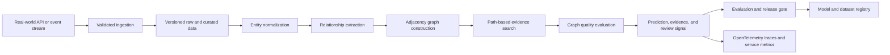

# Architecture

## Problem

Risk teams need relationship-level explanations instead of opaque entity scores.

## System Flow

## Components

- **Entity normalization**
- **Relationship extraction**
- **Adjacency graph construction**
- **Path-based evidence search**
- **Graph quality evaluation**

## Recommended Production Stack

- FastAPI for entity and evidence APIs
- Neo4j Community or PostgreSQL recursive queries
- Sentence Transformers for entity resolution
- NetworkX for local graph validation
- Kafka-compatible event ingestion
- OpenTelemetry for lineage and query traces

## Hugging Face Tasks

- `token-classification`
- `feature-extraction`
- `question-answering`
- `sentence-similarity`

## Model Architecture

The included baseline is a transparent token-prototype model. Training builds
per-label token weights and inverse-document-frequency retrieval weights from
the synthetic training split. The runtime returns a prediction, confidence,
review flag, and evidence documents. This baseline is intentionally small so
it can run in CI without paid compute.

For production, compare it with domain embeddings, gradient-boosted models, or
fine-tuned transformer models using the same held-out evaluation contract.

## Production Boundaries

- Validate and version all input schemas.
- Keep human review for low-confidence or high-impact decisions.
- Store prompts, traces, model versions, and dataset versions together.
- Do not treat synthetic evaluation performance as production evidence.
- Add authentication, authorization, encryption, and retention controls.

## Known Risks

All entities are fictional. Real identity or financial data requires governance, consent, and bias review.
